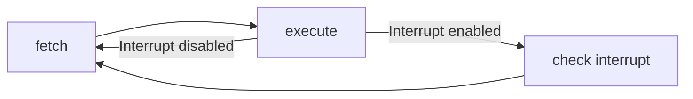

# Interrupts
[**GitHub Link**](https://github.com/isbobby/cs-fundamentals/tree/main/os)
Interrupts are provided primarily as a way to improve processor utilization. I/O modules are much slower than processor and having the processor wait for the I/O modules waste a huge amount of time idling.

## Interrupt Requests
In computer systems, the I/O modules are allowed to send an interrupt request signal to the processor. Upon receiving an interrupt request, the processor responds by suspending operation of the current program, branching off to a routine to service that particular I/O device.

The accommodate interrupt requests, an **interrupt stage** is added to the instruction cycle (on top of fetch and execute).

If an interrupt request is pending, the processor suspends the execution of the current program and executes an interrupt service routine. There is a small amount of overhead in executing the extra instructions.

## Interrupt Processing
An interrupt triggers a number of important events both in hardware and software.

### Sequence of Hardware Events
1. Module sends interrupt signal
2. Processor finishes fetching and executing current instruction
3. Processor signals acknowledgment of interrupt
4. Processor pushes Program Status Word (PSW) onto control stack (Context Saving)
5. Processor loads new PC value based on interrupt (Points to interrupt handling routine)

### Sequence of Software Events
7. Save remainder of process state information
8. Process interrupt
9. Restore process state information (load context to resume previous execution)
10. Restore old PSW and PC values

## Multiple Interrupts
Two or more modules may generate interrupt requests at the same time. There are two main approaches to deal with multiple interrupts.

### Interrupt Disabling
A processor can disable any incoming interrupts while another interrupt is underway. Any new interrupt will remain pending and will be checked only after the current interrupt is serviced.

The draw back of this approach is that it does not take into account relative priority or time-critical needs. 

### Nested Interrupt
Another approach is to assign priority to interrupts and allow a lower priority interrupt to be halted by a higher priority interrupt.

When an interrupt of higher priority is being serviced, any lower priority interrupt will remain in pending state.

